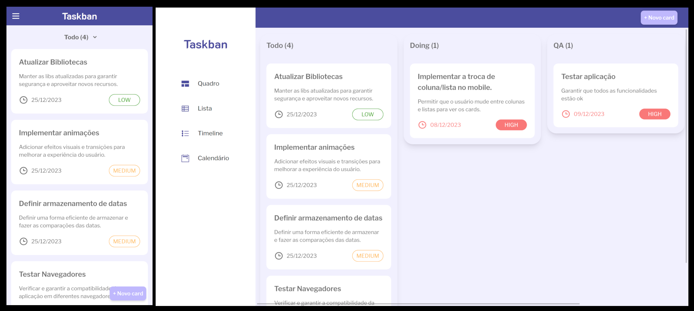

# Quadro Kanban

## Sobre

Esse projeto foi feito para um desafio técnico da [HeroCode](https://github.com/HeroCodeBR/). O objetivo é criar um quadro kanban que exibe listas e seus cards/tarefas que podem ser criados e movidos.

Acesse aqui o repositório do [desafio](https://github.com/HeroCodeBR/01-tech-challenge)

## Status

O projeto ainda está em desenvolvimento.

## Funcionalidades

Para proporcionar uma melhor experiência de usuário o projeto foi desenvolvido utilizando mobile first e algumas mudanças de layout foram feitas no design mobile. Visite aqui o [figma do projeto](https://www.figma.com/file/0TAp62K2aCp76PMgUmRJd4/Tech-Challenge-Hero-Code-(Copy)?type=design&node-id=1%3A968&mode=design&t=OdHMkGs8oFIjJcrL-1).

- No design mobile uma lista é exibida por vez para uma melhor visualização das tarefas
- Existe um input que permite selecionar a lista de tarefas
- Arrastar para os lados no mobile também muda a lista de tarefas
- Drag and drop: é possível arrastar os cards de tarefas no moile e mudar suas ordens na lista de tarefas.
- As tarefas são salvas no local storage
- No mobile a barra lateral de navegação virou um menu que pode ser fechado

## Ferramentas utilizadas

- next.js
- typescript
- tailwind
- react-dnd
- zod
- react-hook-forms
- shadcn
- eslint
- react icons

## Como rodar o projeto

### Requisitos

- node
- npm

### Rodando o projeto

1. clone ou baixe os arquivos do repositório
2. instale as dependências com `npm install`
3. rode o projeto com `npm start`
4. acesse o projeto em `http://localhost:3000`
